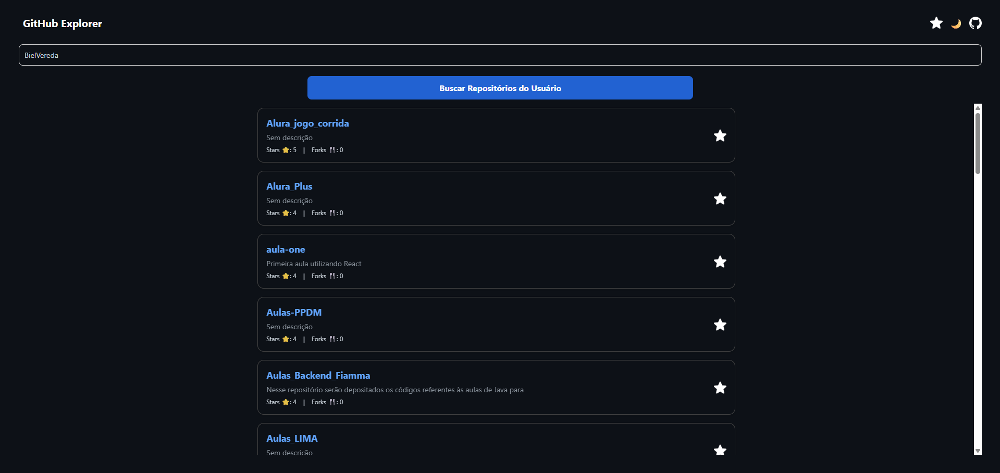
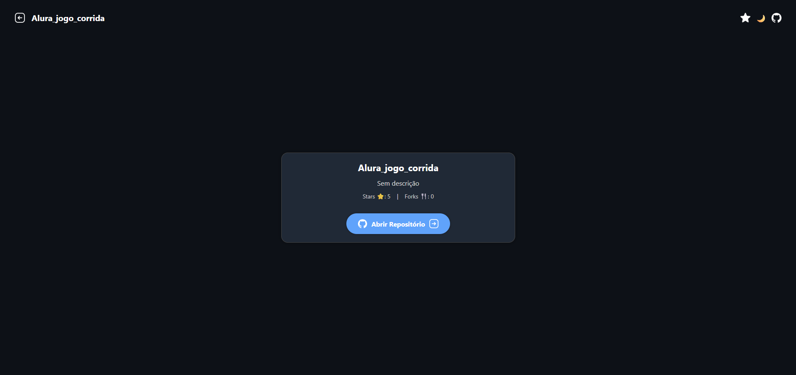
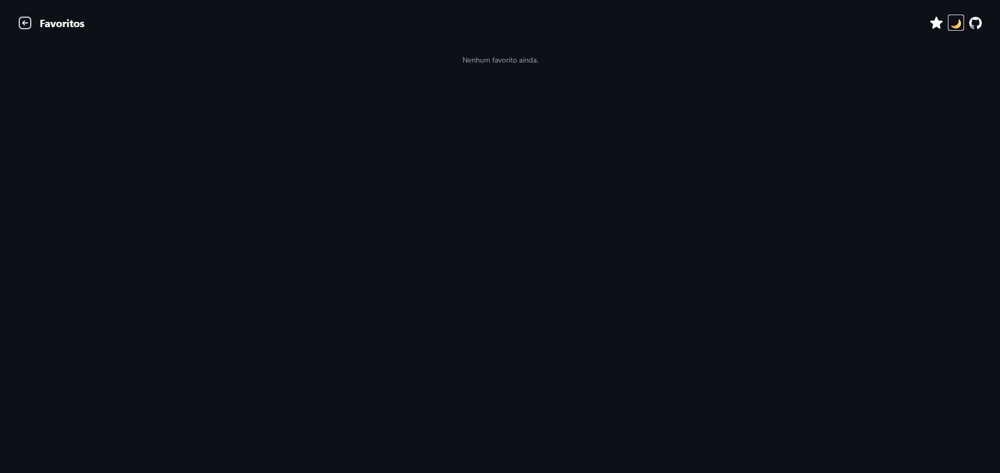
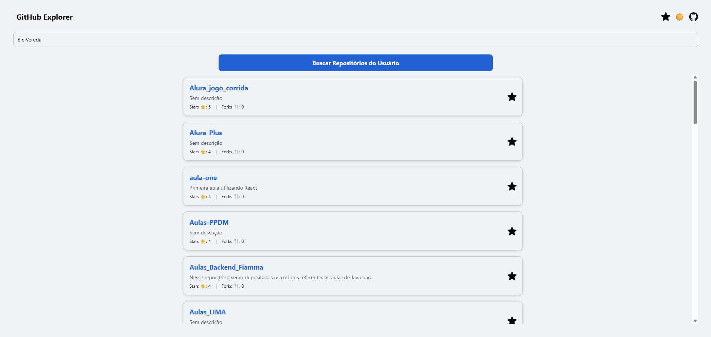
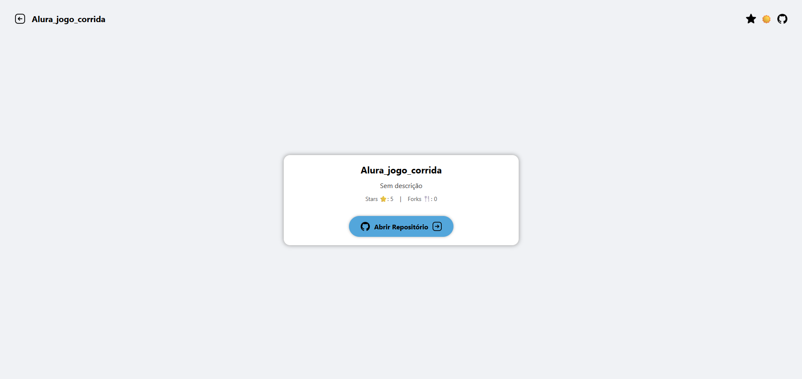
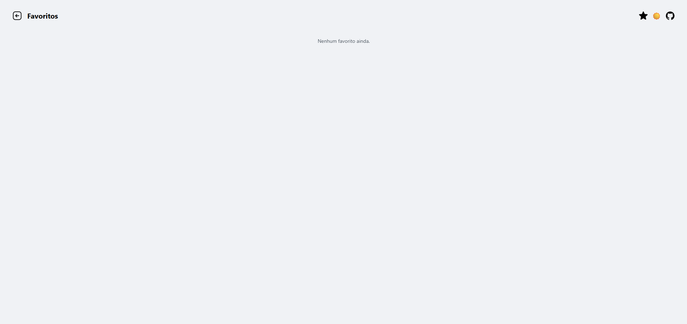

# GitHub Explorer

Aplicação mobile desenvolvida em **React Native + Expo** para explorar repositórios públicos do GitHub através da API oficial do GitHub.

O aplicativo permite pesquisar usuários, visualizar seus repositórios, acessar detalhes completos dos projetos e salvar favoritos localmente.

---

# 📱 Preview do Projeto

## 🌙 Dark Mode

### Home


### Details


### Favorites


---

## ☀️ Light Mode

### Home


### Details


### Favorites


---

# 🚀 Funcionalidades (RF - Requisitos Funcionais)

O aplicativo possui as seguintes funcionalidades:

### ✅ Buscar repositórios
O usuário pode pesquisar qualquer perfil público do GitHub através do username.

### ✅ Listagem de repositórios
Os repositórios encontrados são exibidos em uma lista utilizando FlatList.

### ✅ Visualização de detalhes
Ao clicar em um repositório, o usuário é redirecionado para uma tela de detalhes.

### ✅ Favoritar repositórios
O usuário pode salvar repositórios favoritos utilizando AsyncStorage.

### ✅ Alternância de tema
O app possui tema claro e escuro com troca dinâmica.

### ✅ Navegação entre telas
A navegação foi implementada utilizando React Navigation.

---

# ⚙️ RNF (Requisitos Não Funcionais)

### ✅ Tratamento de erro
O app trata erros de requisição da API e usuários inexistentes.

### ✅ Estado de carregamento
Foi utilizado ActivityIndicator durante o carregamento das requisições.

### ✅ Persistência local
Os favoritos são armazenados localmente utilizando AsyncStorage.

### ✅ Responsividade
As telas foram organizadas para melhor adaptação em diferentes tamanhos de dispositivos.

### ✅ Código modular
A aplicação segue uma arquitetura modular com separação de responsabilidades.

### ✅ Navegação fluida
As telas possuem transições rápidas e organizadas.

---

# 🎨 Style Guide

## 🎨 Paleta de Cores

### Dark Theme
| Elemento | Cor |
|---|---|
| Background | `#0d1117` |
| Card | `#1f2937` |
| Texto Principal | `#c9d1d9` |
| Texto Secundário | `#8b949e` |
| Primary | `#58a6ff` |

### Light Theme
| Elemento | Cor |
|---|---|
| Background | `#f0f2f5` |
| Card | `#ffffff` |
| Texto Principal | `#24292e` |
| Texto Secundário | `#57606a` |
| Primary | `#0969da` |

---

## 🔤 Tipografia

| Elemento | Tamanho |
|---|---|
| Títulos | 20px - 22px |
| Texto padrão | 14px - 16px |
| Informações secundárias | 12px - 14px |

---

## 🧩 Componentes Utilizados

### Button
Componente reutilizável para ações principais.

### CardRepo
Card responsável pela exibição dos dados dos repositórios.

### Header
Cabeçalho reutilizável contendo:
- Navegação
- Alternância de tema
- GitHub Link
- Favoritos

---

# 🛠️ Tecnologias Utilizadas

- React Native
- Expo
- Axios
- React Navigation
- Context API
- AsyncStorage
- Animated API

---

# 🌐 API Utilizada

API oficial do GitHub:

```bash
https://api.github.com
```

Exemplo de endpoint utilizado:

```bash
/users/{username}/repos
```

---

# 📂 Estrutura de Pastas

```bash
src/
┣ assets/
┃ ┗ Ícones e imagens locais do projeto
┃
┣ components/
┃ ┣ Button.js
┃ ┣ CardRepo.js
┃ ┗ Header.js
┃
┣ context/
┃ ┗ ThemeContext.js
┃
┣ hooks/
┃ ┣ useAssets.js
┃ ┗ useTheme.js
┃
┣ routes/
┃ ┗ index.js
┃
┣ screens/
┃ ┣ Home.js
┃ ┣ Details.js
┃ ┗ Favorites.js
┃
┣ services/
┃ ┗ api.js
┃
┣ styles/
┃ ┣ global.js
┃ ┗ theme.js
┃
┗ App.js
```

---

# 🧠 Importância da Arquitetura Modular

A separação em pastas facilita:

- Reutilização de componentes
- Organização do código
- Escalabilidade do projeto
- Facilidade de manutenção
- Melhor leitura para outros desenvolvedores

Essa estrutura segue uma abordagem semelhante à Clean Architecture simplificada.

---

# 🔄 Navegação

O projeto utiliza React Navigation com Stack Navigator.

Fluxo das telas:

```bash
Home → Details
Home → Favorites
Favorites → Details
```

---

# 🔥 Gerenciamento de Estado

O gerenciamento global do tema foi implementado utilizando:

- Context API
- useContext
- useState

Permitindo alternância entre:
- Light Mode
- Dark Mode

---

# 💾 Persistência de Dados

Os favoritos são armazenados localmente utilizando:

```bash
@react-native-async-storage/async-storage
```

Assim os dados permanecem salvos mesmo após fechar o aplicativo.

---

# 📡 Consumo de API

O consumo da API foi realizado utilizando Axios.

Exemplo:

```js
const response = await api.get(`/users/${username}/repos`);
```

---

# 🧪 Testes e Validação

O aplicativo foi testado utilizando:

- Expo Go
- Android Studio Emulator

Validações realizadas:

✅ Busca de usuários  
✅ Navegação entre telas  
✅ Funcionamento dos favoritos  
✅ Alternância de tema  
✅ Tratamento de erro da API  
✅ Responsividade básica  
✅ Scroll da FlatList  

---

# 📱 Responsividade

Foram utilizados:

- Flexbox
- FlatList
- Width dinâmica
- Alignments responsivos

Garantindo melhor adaptação entre diferentes tamanhos de tela.

---

# 🛡️ Safe Area

A aplicação utiliza estrutura adequada para evitar sobreposição com:

- Barra de status
- Bordas do dispositivo
- Notch

---

# ⚙️ Instalação e Execução

## 1️⃣ Clone o repositório

```bash
git clone https://github.com/BielVereda/GitHub_API.git
```

---

## 2️⃣ Acesse a pasta

```bash
cd GitHub_API
```

---

## 3️⃣ Instale as dependências

```bash
npm install
```

ou

```bash
yarn install
```

---

## 4️⃣ Execute o projeto

```bash
npx expo start
```

ou

```bash
yarn start
```

---

# 📦 Dependências Principais

- axios
- @react-navigation/native
- react-native-screens
- react-native-safe-area-context
- react-native-gesture-handler
- @react-navigation/native-stack
- @react-native-async-storage/async-storage

Comando para instalar as dependências se já estiverem no package:
```bash
npm i
```

---

# 🧾 Commits Semânticos

O versionamento do projeto foi realizado utilizando commits semânticos.

Exemplos:

```bash
feat: adiciona tela de favoritos
fix: corrige erro no tema dark
style: melhora estilização do header
refactor: reorganiza estrutura de componentes
```

---

# 👨‍💻 Desenvolvedor

Desenvolvido por **BielVereda**.

---

# 📌 Considerações Finais

O projeto foi desenvolvido como MVP (Produto Mínimo Viável) com foco em:

- Arquitetura organizada
- Componentização
- Consumo de API REST
- Navegação fluida
- Persistência local
- Responsividade
- Experiência do usuário