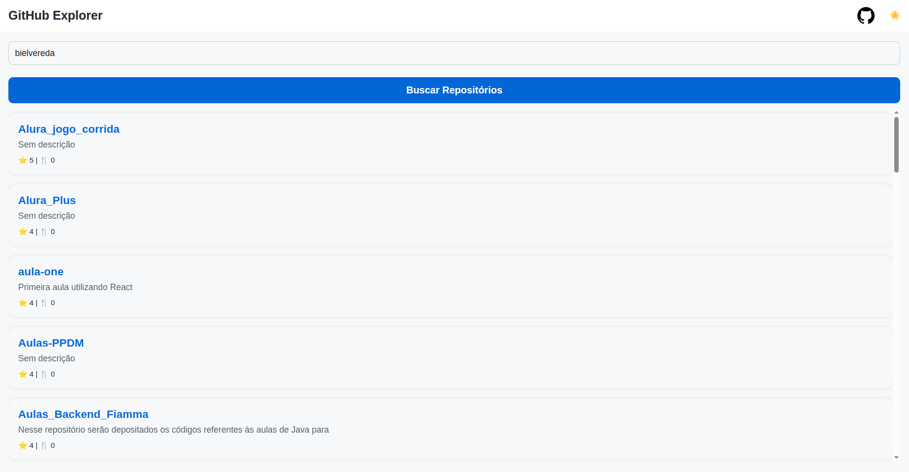
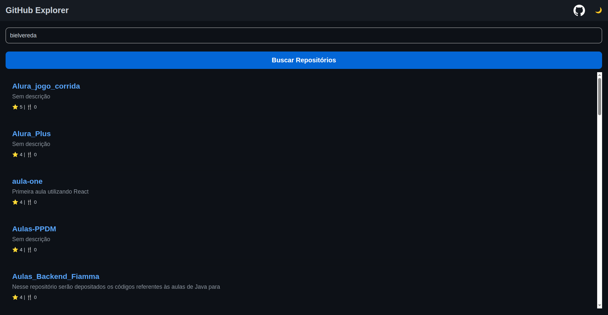

# GitHub Explorer

Aplicação em **React Native** para explorar repositórios do GitHub de qualquer usuário.  
Permite buscar repositórios, visualizar detalhes e alternar entre **tema claro e escuro** com transição suave.

---

## 🚀 Funcionalidades

- Buscar repositórios de um usuário do GitHub
- Exibir nome, descrição, estrelas e forks de cada repositório
- Navegar para detalhes de cada repositório
- Alternar entre **tema claro/dark** com animação suave
- Ícone do GitHub dinâmico (preto no light, branco no dark)
- Estrutura organizada em componentes reutilizáveis

---

## 🛠️ Tecnologias

- [React Native](https://reactnative.dev/)
- [React Navigation](https://reactnavigation.org/)
- [Axios](https://axios-http.com/) para consumo da API do GitHub
- Context API para gerenciamento global de tema
- Animated API para transição suave entre temas

---

## 📂 Estrutura de Pastas
```
src/
┣ assets/              # ícones locais (github-dark.png, github-light.png)
┣ components/          # Header, CardRepo, Button
┣ context/             # ThemeContext (tema global)
┣ hooks/               # useAssets (centraliza ícones)
┣ screens/             # Home, Details, Favorites
┣ routes/              # Navegação
┣ services/            # api.js (configuração Axios)
┣ styles/              # theme.js (light/dark)
App.js
```

---

## ⚙️ Instalação

1. Clone o repositório:
```
git clone https://github.com/seu-usuario/github-explorer.git
```

2. Instale as dependências:
```
npm i
```
# ou
```
yarn install
```

3. Execute o projeto na Web:
```
npx expo start
```
# ou
```
yarn start
```

**Extra:** Para rodar no emulador ou dispositivo:
```
npm run android
```
# ou
```
npm run ios
```

## 🎨 Tema Global
- **Tema padrão:** dark
- Alternância manual via botão 🌙/☀️ no Header
- Transição suave entre cores usando Animated.Value e interpolação
- Todos os componentes (Header, Home, CardRepo) respondem ao tema

## 📸 Demonstração

### Light Mode


### Dark Mode
